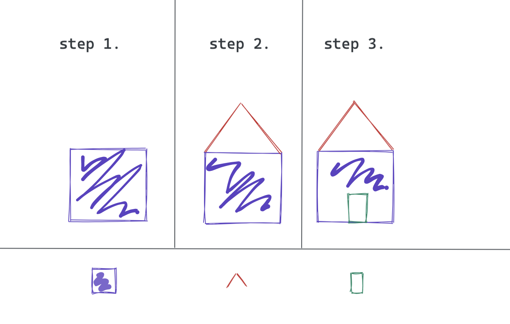
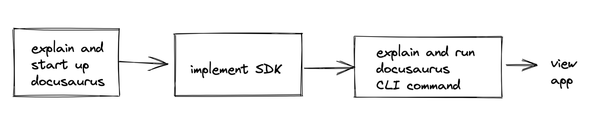
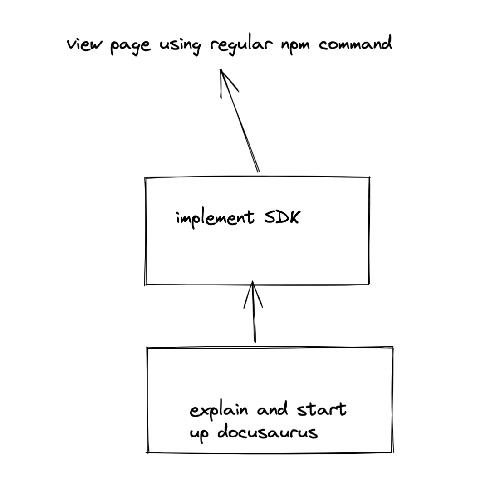

## Using Visual Thinking to Teach

How would you teach someone to draw a house? What would you say? I might write something like this.

> "Draw a horizontal line. Draw two lines of the same length, starting from the ends of the original line, and perpendicular to the original line. Connect the two lines with another straight line. Now you have a square. From the top corner of your square, draw a line at roughly 45 degrees to the top line of the square..."

Whew. That's already a mouthful, and we haven't even finished the roof yet.

[Ed Emberly](https://en.wikipedia.org/wiki/Ed_Emberley) was an artist who taught children how to draw. If he were to teach a child to draw a house, he would draw something like this (this is my own drawing):

Without a single word, you understand how to draw a house in a moment or two.

This is power of visual thinking. It's important in all aspects of teaching. In developer advocacy, it can be used to teach audiences with graphs and maps and videos (of course, audio must also be supplied). Visual thinking can also help developer advocates create the constraints they need to be creative. I think this is the less obvious point, so let's talk about it.

## Using Visual Thinking to Plan Projects

Let's say I were a developer advocate who was planning a tutorial to introduce developers to a new SDK (Software Development Kit). Say that this SDK provides the developer with a type of hyperaccurate timestamp. To show the purpose of the SDK, I use it in the framework that I used to build this website, [docusaurus.io](https://docusaurus.io/). I'm also really excited about the docusaurus CLI (Command Line Interface), so I'll describe how to use that to view the pages in development. I'll draw a map of what I'm doing.

Hm. That's a lot of real estate devoted to docusaurus. Only one step is devoted to the SDK I'm writing a tutorial about. Maybe this plan could work for a livestream format, but for a tutorial, I'd better narrow my focus:

There. I've planned my tutorial and given it a good focus, using visual thinking!

## Conclusion

If you're interested in learning more about visual thinking, I highly recommend these resources:

[Edward Tufte's Work](https://www.edwardtufte.com/tufte/)

[The Doodle Revolution](http://doodlerevolution.com/), by Sunni Brown

[Unflattening](https://www.hup.harvard.edu/catalog.php?isbn=9780674744431), by Nick Sousanis
