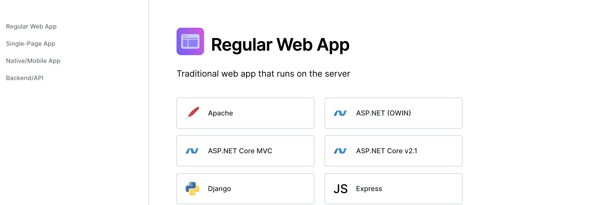
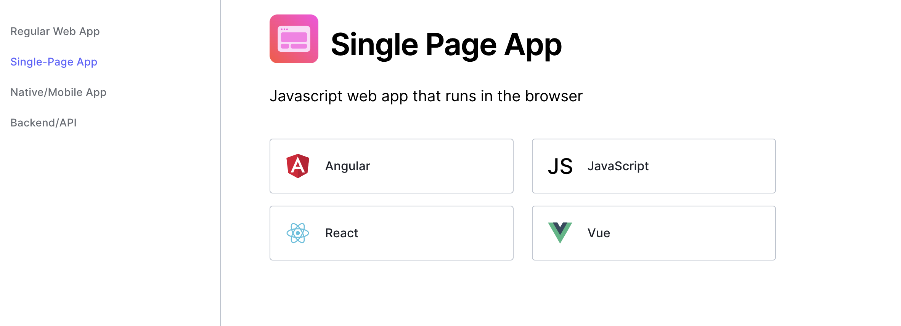
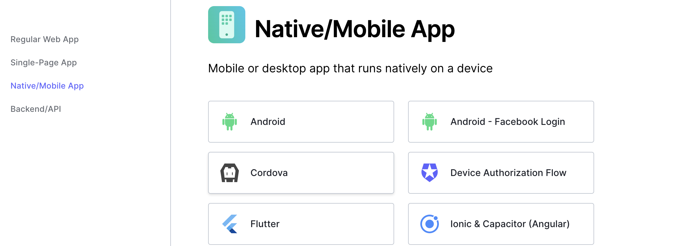
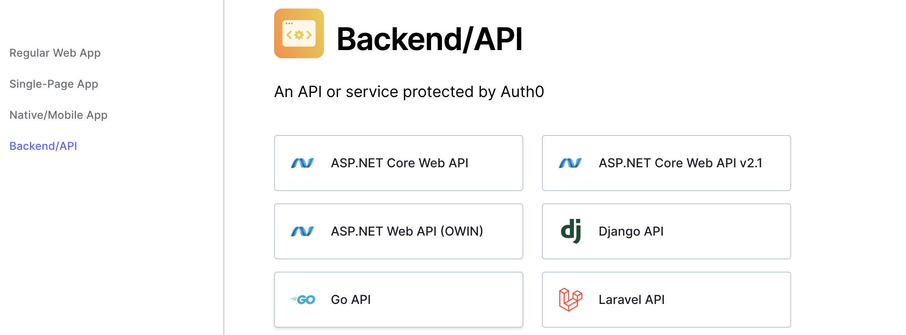

## The Big Picture

[auth0](https://auth0.com/) provides a solution to help you implement authorization (your users' level of access) and authentication (your users' identity) in the applications you build. You know how some website's navigate you to an authentication page that allows you to sign up and log in with your own email, or use Google? auth0 provides a smooth developer experience for implementing that type of functionality on your own application.

_Note: if you're confused about authentication vs. authorization, auth0's docs feature a [great analogy](https://auth0.com/docs/get-started/identity-fundamentals/identity-and-access-management) for remembering the difference. Authentication, or proof of identity, is like showing your badge to a security guard. Authorization, on the other hand, gives access to some resources but not others based on authorization level, like an elevator key sensor that gives you access to some floors but not others._

What kind of applications can you build with it? Well, auth0 provides solutions for several different types of apps.

### Regular Web Apps

Before the new wave of JavaScript apps that ran in the browser came along, most developers relied on apps that ran on the server. This is still the best way to implement many applications, especially those that require frequently refreshed data. auth0 has a generous amount of [getting started resources](https://auth0.com/docs/quickstart/native#webapp) for these types of apps, including tutorials for those apps that might combine server-side rendering with static site generation, like [their Next.js tutorial](https://auth0.com/docs/quickstart/webapp/nextjs/interactive).

### Single Page Apps

auth0 also has support for SPAs ([Single-Page Apps](https://developer.mozilla.org/en-US/docs/Glossary/SPA)). SPAs use JavaScript in the browser to update content in a single page using APIs like [fetch](https://developer.mozilla.org/en-US/docs/Web/API/Fetch_API). This can improve performance, especially for websites like e-commerce pages and blogs, because the data doesn't have to be fetched from the server every single time a page is requested by a user. You can find [tutorials](https://auth0.com/docs/quickstart/native#spa) for Angular, React, JS, and Vue apps on the auth0 website.

### Native Apps

When an app runs natively, that means it is designed to run on a specific platform, rather than being platform-agnostic. For example, an iOS app is designed to run on an iOS operating system, and not an Android operating system. With auth0, you can get started and learn how to implement auth0 in native apps on multiple platforms, including [iOS](https://auth0.com/docs/quickstart/native/ios-swift/interactive), [Windows](https://auth0.com/docs/quickstart/native/windows-uwp-csharp), and [Flutter](https://auth0.com/docs/quickstart/native/flutter/interactive).

https://auth0.com/docs/quickstart/native

### Backends and APIs

You can implement auth0 to secure routes on [many types of backends and APIs](https://auth0.com/docs/quickstart/native#backend). This way, users who are not authenticated may not access private routes.

## Which flow should I use?

auth0 offers different flows, or chains of steps in implementing security.

### Client Credentials Flow

Now that you've been introduced to auth0 and the types of apps it integrates with, you might be wondering about different scenarios for using auth0.

For example, sometimes the person that needs authorization is not a person at all -- it's a machine! If you're not familiar with this type of scenario, think of CLIS ([Command Line Interfaces](https://en.wikipedia.org/wiki/Command-line_interface)), and similar services.

auth0 has designed a flow implementation for this called the [Client Credentials Flow](https://auth0.com/docs/get-started/authentication-and-authorization-flow/client-credentials-flow). A [client credentials flow](https://www.rfc-editor.org/rfc/rfc6749#section-4.4) flow is appropriate when the client happens to be requesting access to requested resources which are also under its control, so when the flow is implement, the client only uses the client credentials to request access.

### Authorization Code Flow

auth0's Authorization Code Flow is a [ten-step flow appropriate](https://auth0.com/docs/get-started/authentication-and-authorization-flow/authorization-code-flow) for server-side apps with end users who can provide login details and consent. Inside this flow, the Authorization Code is exchanged for a token. It can't be used for browser-side code because the Client Secret is sent in the flow, and that would be visible in the browser. It's also super safe since the token is passed directly to the Client.

### Resource Owner Password Flow

This flow is not highly recommended, but it works in cases when the application can be trusted with the credentials. This is because this flow allows the credentials to be stored on the backend.

You can read more about it in auth0's [resource](https://auth0.com/docs/get-started/authentication-and-authorization-flow/resource-owner-password-flow).

### Authorization Code Flow with Proof Key for Code Exchange (PKCE)

[This flow](https://auth0.com/docs/get-started/authentication-and-authorization-flow/authorization-code-flow-with-proof-key-for-code-exchange-pkce) is designed for SPAs and for mobile apps. Since these apps cannot store a Client Secret because it would then be exposed through either the browser or decompilation, auth0 recommends this alternative PKCE approach. The PKCE flow accepts a value from the calling app called a Code Challenge. It is a transform value of a secret called a Code Verifier, and without this original value an attacker would not be able to exchange it for a valid token.

### Implicit Flow with Form Post

If you're working with a mobile app and the only thing you want to implement is login functionality, you can work with something called [Implicit Flow with Form Post](https://auth0.com/docs/get-started/authentication-and-authorization-flow/implicit-flow-with-form-post). There's no backend calls and no need to store secrets in your app.

## Conclusion

I hope this post has given you a good big picture of how auth0 works! It's good to start with the type of application (Machine to machine? Mobile? SPA? Traditional?) and then identify the type of flow you need before you implement. If you have any more questions about implementation details, you can always head over to the [auth0 docs](https://auth0.com/docs/).
