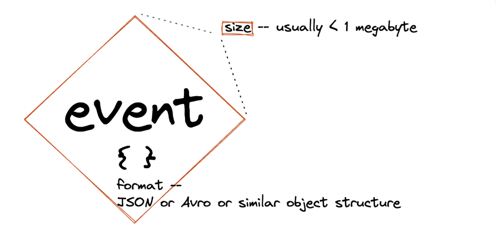
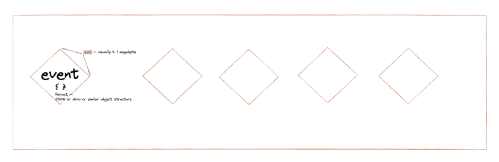
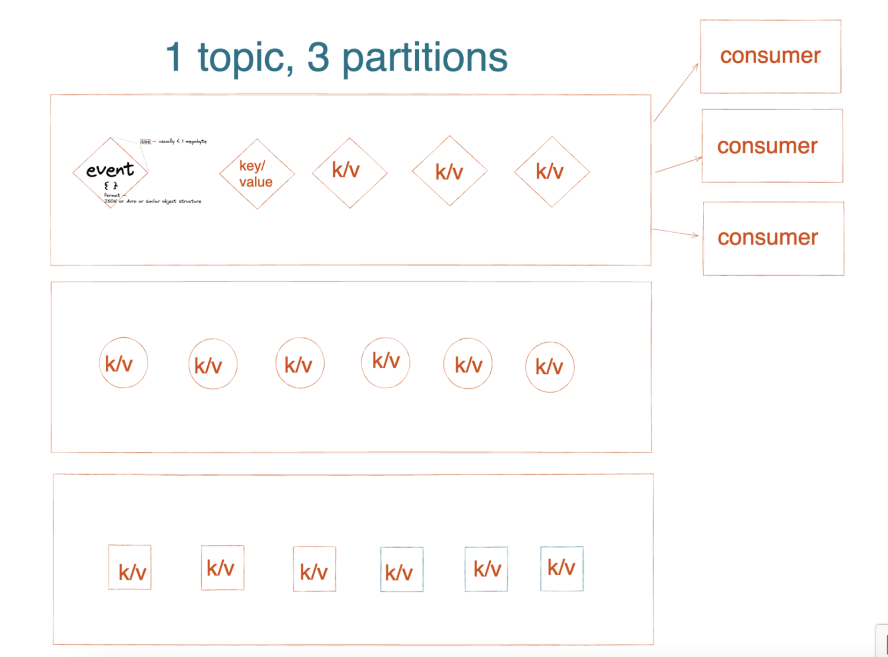
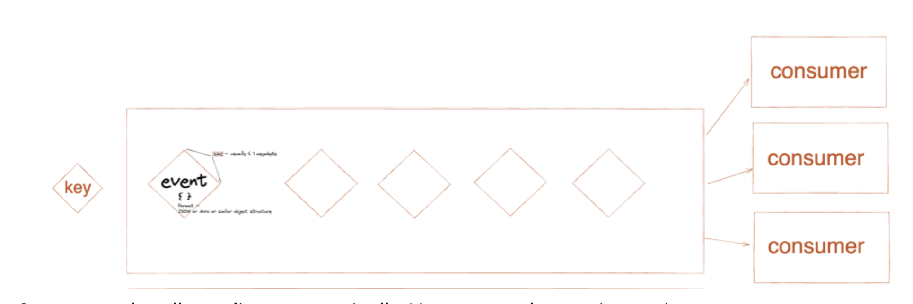

# Introduction

A couple weeks ago I started a brand new role: Developer Advocate at Confluent. So far I’ve been gladdened by stepping fully into an area of tech that satisfies my teaching heart. I’ve also felt supported by my new teammates. I’m new to the Kafka scene, with a background in JavaScript and GraphQL. In order to help onboard me smoothly, my teammates are meeting with me frequently, checking in on my progress (they even reviewed this article 😉), and are helping me select material from Confluent’s abundance of resources to learn Kafka. 

My first step in my learning journey was this course on Kafka 101. I took notes throughout the course, which broke Kafka down to its core concepts. I'll share the synthesis of those notes below in hopes that if you're coming from a similar background, you'll find it useful!

# What is Kafka?

According to its website, Kafka is a "distributed event streaming platform".

Well, what does that mean to me, a mostly-JavaScript developer with a background in web development and GraphQL? My usual approach to learning entirely new concepts is to take a back-to-square-one approach and understand some fundamental vocabulary first. Much like you might estimate the result of a math problem before tackling its execution (e.g., estimating that the sum of 219 + 38 will not be above 300), I like to situate myself with respect to the context of a new skill before executing it. The following paragraphs set the context of Kafka by defining and illustrating key concepts. 

# What is an Event?
So, a "distributed event streaming platform". The key piece of terminology here is 'event'. Before I took the course, I understood an event as a 'thing that happens', which still holds up within the context of Kafka. In Kafka, events are things that happen, and the representation of these things are recorded by machines.

Let’s take, for example, the event of a credit card transaction. The event is composed of a notification and the event’s state.  To implement this event in Kafka, you’d need certain pieces of information, including a key, value, timestamp, and optional metadata headers. So you’d have something like: 

Key: “Credit Card Payment”
Value: “Paid $12.50 for a ham sandwich”
Timestamp: “05/01/2022”


Kafka serializes these pairs into a structured format like JSON, Avro, or Protobuf. By default, event sizes in Kafka are 1MB. 




# What is a Topic?



At a high level, topics are ways of organizing events. They are programmatic logs of events, as opposed to application logs. You can see this article by Jay Kreps to learn more about the difference. Logs have 3 noteworthy aspects:

They are append-only. New messages are only applied to the end of a log. They can't be inserted—unlike with a different structure (like a graph).
You can't change events in a log. This was important for me to wrap my head around since I was coming from a GraphQL background, and you can certainly mutate data objects using GraphQL.
Access to logs is sequential from a given offset, so they're read by picking an arbitrary offset and scanning.

# What is a Cluster?

Ok, cool, but where are these events and logs kept so I can access them? Are they hosted somewhere? Kafka's storage layer is a cluster of things called brokers. Brokers are servers that handle things like write and read requests to partitions, as well as replication. Which brings us to:

# What is a Partition?



Logs are hosted and replicated across a cluster of machines, rather than clogging up one machine 🪠. 
Partitions make this possible. They take a single topic log and break it up into multiple logs.

Now, how are messages written to partitions? If the messages are keyless, they'll be assigned one after the other until the last partition is reached, in which case the process starts from the top. Messages which have keys are assigned to partitions holding messages with the same keys. Kafka does this by hashing the key and using a mod function. If you want to take a deep dive into partitions, you can read this blog post by Ricardo Ferreira that examines them from the perspective of both developers and data ops.

# What is a Producer?
The producer sends the key value pairs to the clusters, managing the interaction between brokers over a network. Incidentally, producers are also responsible for message assignment to partitions. You can view a producer instance created with the Confluent client in Python in the Confluent Developer website.


```python
   # Parse the configuration.
    # See https://github.com/edenhill/librdkafka/blob/master/CONFIGURATION.md
    config_parser = ConfigParser()
    config_parser.read_file(args.config_file)
    config = dict(config_parser['default'])

    # Create Producer instance
    producer = Producer(config)
```
What is a Consumer?

A Kafka consumer reads the data from the stream. Many independent consumers can read from one topic. When a message is read it is not deleted. 



Consumers handle scaling automatically. You can see how to instantiate a consumer instance in Node.JS on the Confluent Developer "Getting Started" tutorial.

```javascript
function createConsumer(config, onData) {
  const consumer = new Kafka.KafkaConsumer(
      createConfigMap(config),
      {'auto.offset.reset': 'earliest'});

  return new Promise((resolve, reject) => {
    consumer
     .on('ready', () => resolve(consumer))
     .on('data', onData);

    consumer.connect();
  });
};
```
# Conclusion

Let's go back to the original definition of Kafka, a "distributed event streaming platform". We now know that an event is a representation of a thing that happens expressed in a key value pair. These events are organized by topics, logs which are partitioned by producers and read by consumers. The platform is a cluster of brokers that enable replication and fault tolerance. Together, this system is Kafka.
The system arises from the viewpoint that data is not static -- that it's everywhere, flowing and interconnected. That doesn't mean you can't integrate streaming data with classic data sources like databases and REST APIs, or that you can't filter, transform, and manage it. But that's a topic for another day ;)