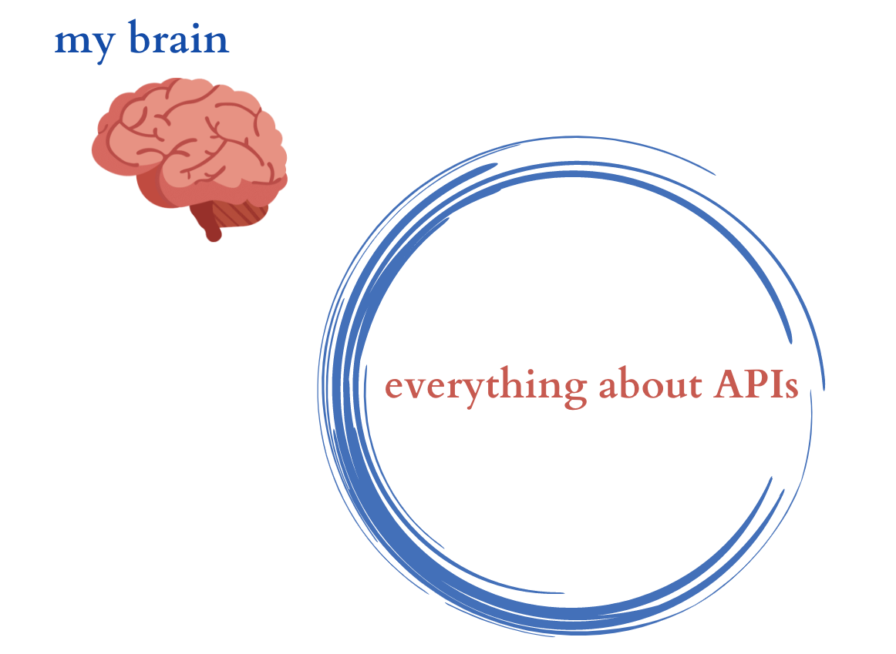
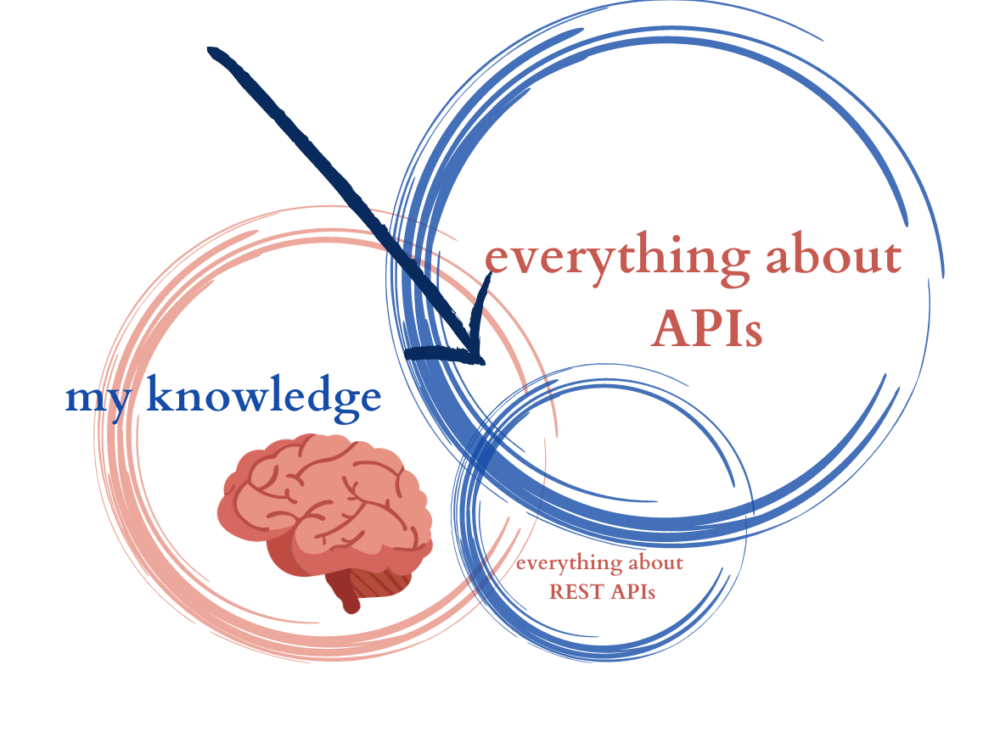
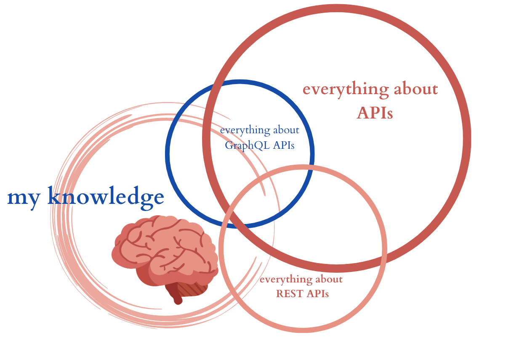

Over my career I've had to learn new things many, many times. I've been an elementary school teacher, a digital marketer, a software engineer, and now I'm a full-time developer advocate. Over and over again, I've had to learn completely new concepts. It's great; it keeps me humble, it keeps me happy. There's a lot of dopamine involved in learning. But one of the most difficult parts of learning is _knowing what you don't know_. And knowing what you don't know is important, because it keeps you from making the types of mistakes that emanate from errors in judgment.

I've learned a couple of things about defining the limits of my knowledge about a concept. I'm sharing my framework here in case it's helpful to anyone else in tech.

## Stage 1: Nothing

The first stage of getting to know a new concept is the easiest to define. I'm starting from nothing!

This is great. I know exactly what I don't know. Let's say I'm completely brand-spanking new to the concept of an API. Here is a diagram of what I don't know about APIs:

It doesn't get more accurate than that. I'm not kidding. "What you don't know" will surprise you again, and again, and again. The framework I'm suggesting here will not save you from being wrong in front of people. But I think it will give you some general guidance on how to approach learning new things.

## Stage 2: One Instance of a Concept

So let's consider universal concepts. Definitions that we all agree on. For example, an API [according to Wikipedia](https://en.wikipedia.org/wiki/API) is

"An application programming interface (API) is a way for two or more computer programs to communicate with each other."

Maybe that's not the most complete definition, but I think most techies would agree on what's there. Now, you can memorize this definition, but you won't have experiential knowledge of an API until you've met one out in the wild.

Let's say I'm at that stage. I'm getting used to querying a REST API, and I'm learning to build one myself with Python or Node Express or something. This definition applies to the REST API I'm building, so I'm gaining experience with one type of API. One particular instance of this universal concept. Here is another map of my brain:

So, I'm learning something about REST APIs. And that's it for now. The arrow is pointing to a boundary that I'm not aware of:

_ I don't know what's common to REST APIs and all APIs, and what's different._

So, I've seen one particular instance, but I've not seen another instance of an API. And this is a problem because there are different kinds of APIs underneath the universal concept of "API". Like there are different kinds, or species, of cats underneath the "cat" genus. And tigers are very different from lions.

## Stage 3: Two instances, of different kinds, of a concept.

Say I start implementing not a REST API, but a GraphQL API. It's a different kind of API from a REST API, like lions are a different kind of cat from tigers. My worldview on APIs begins to break down. It's destroyed by differences between REST APIs and GraphQL APIs, like

-   GraphQL is an application layer, while REST is a style of API. Not every API is in the REST style!
-   GraphQL requests are JSONesque, while REST requests are often parameterized in URLs. Not every API uses parameters the same way! Or has the same request format.
-   You define GraphQL with a schema, rather than a list of endpoints. Not every API is defined the same way!

I know that diagram just got complicated, I'm sorry. But this is the most important stage to take notes at. Why? Because when you realize what assumptions you've made, you realize what questions to ask the next time you encounter a new kind of API.

These are the assumptions I've made:

-   All APIs are in the same style.
-   All API requests are formatted alike.
-   You define APIs in the same way.

Now that those assumptions have been broken by my experience, I know what questions to ask next time I'm learning a new kind of API.

## Stage 4: The third instance of a different kind.

Ok, say I'm learning what a tRPC API is in order to implement on at work or something. Based on the kinds of assumptions I made last time, what might I ask now?

-   How does the style of tRPC compare to REST and GraphQL, the ones I'm familiar with?
-   How are tRPC requests formatted?
-   How do I map or define a tRPC API?

These questions will help me understand what a tRPC API is much faster than I understood what a REST or GraphQL API is.

Furthermore, I'll be understanding the general concept of an API even better, because I'll be understanding what is in common between all these kinds of APIs. I'll also be understanding GraphQL and REST APIs better at this stage, because I can then make lists of their limitations.

## Generalizing this process

I think every time you learn something new, you have to go through these 4 stages and there's not really a way around that.

But if you do it consciously, it speeds up the process of learning.

So when you're beginning, acknowledging "I know nothing about this. I should ask someone who knows something about this what is the best instance to build first," can save you some pain.

Then again, once you've built your first instance, acknowledging "I might be making assumptions here that don't apply to other instances. I should ask someone who has built other kinds of instances what the differences are," will help you make decisions about whether to learn a new paradigm when you're building your next instance.
