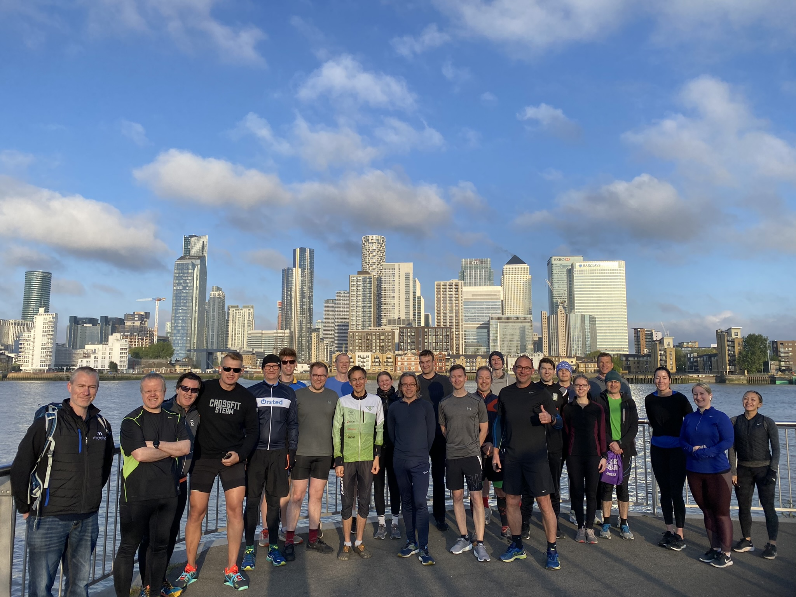

# Kafka Summit London 5k Fun Run 

At [Kafka Summit London 2023](https://www.kafka-summit.org/events/kafka-summit-london-2023/about) some of us will be going on a run (or walk-- that'll be my speed!) and all are welcome! 

Here's a picture of the hale and hearty participants from last year's KSL Fun Run: 

Hopefully we'll see a similar crowd this year! 

## The Details: 

Who's invited: Anyone who would like to! We will have an experienced runner taking the role of lead runner, and I will be taking the 5k at a walking pace at the back. No matter your experience level, you'll have company! 

Where will we start: We'll start and end at the [Aloft](https://www.marriott.com/en-us/hotels/lonal-aloft-london-excel/overview/?scid=f2ae0541-1279-4f24-b197-a979c79310b0) London hotel. 

What time? We'll meet at 6:15 in the hotel foyer for pictures, and then take off at 6:30! If you're walking, it won't take more than an hour, so you'll be back at the hotel in time to get ready for more conference fun! 

## No Registration Required

This is not an official run so no sign-up is required! Just show up if you're feeling like exercising away some of that morning fog or jetlag :) 